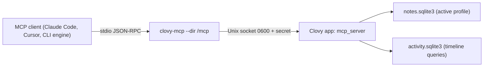

# Clovy MCP server

Local MCP clients (Claude Code, Cursor, and the CLI chat engines) read the
active profile's notes, dictations, memories, and activity through a stdio MCP
server, `clovy-mcp`. It is off by default, answers only while Clovy is open
with the server turned on in Settings, Agent, and everything is read-only.
Requirements: the `clovy-mcp-server` spec of the OpenSpec change
`add-activity-intelligence`; decision record:
[ADR-0058](adr/0058-clovy-mcp-server-relays-to-the-running-app.md). Terms are in
[CONTEXT.md](../CONTEXT.md#activity-capture).

## Where the code lives

| Path | What |
| --- | --- |
| `src-tauri/src/mcp_server/mod.rs` | Switch, listener lifecycle, Tauri commands, configuration snippets, per-message data access |
| `src-tauri/src/mcp_server/channel.rs` | Unix socket + installation secret, handshake, listener, client connect |
| `src-tauri/src/mcp_server/stdio.rs` | The `clovy-mcp` relay (and its answers while the app is unreachable) |
| `src-tauri/src/mcp_server/protocol.rs` | MCP JSON-RPC: lifecycle, `tools/*`, `resources/*`, `clovy://context`, `clovy://guide` |
| `src-tauri/src/mcp_server/tools.rs` | The tools and their limits |
| `src-tauri/src/bin/clovy_mcp.rs` | Binary entry point |
| `src-tauri/bundle-clovy-mcp.sh` | macOS `beforeBundleCommand` step: copies and signs the binary into `.tauri-helper/` |
| `src/components/settings/McpServerSection.tsx`, `src/lib/mcp-server.ts` | Settings, Agent section and its bindings |

Tests: `cargo test mcp_server` (protocol against test databases, the relay
through a real socket, refusal without the secret) and
`src/test/mcp-server-section.test.tsx`.

## Shape

The binary never opens a database: the activity key lives only in the
Keychain for the app, and the capture thread owns the activity store. It
relays each line to the app, which answers with the same queries, exclusions,
and retention as the agent tools and the "Today" view.

## Local channel

- Directory `<app data dir>/mcp/` (mode 0700): `clovy.sock` (Unix socket, mode
  0600) and `secret` (64 hex characters, mode 0600, created the first time the
  server starts and kept across restarts: the installation secret).
- The listener runs only while the switch is on; turning it off closes every
  connection and removes the socket. A socket left by a crash is replaced on the
  next start.
- Handshake: the client's first line is `{"clovyMcp": 1, "secret": "<hex>"}`.
  The app checks the peer's user id (same user only) and compares the secret in
  constant time, then answers `{"clovyMcp": 1, "ok": true}` or
  `{"clovyMcp": 1, "ok": false, "error": "unauthorized"}` and closes.
- After `ok`: newline-delimited MCP JSON-RPC messages in both directions, at
  most 4 MiB per line; requests run concurrently and answers may arrive out of
  order (matched by `id`).
- Unix socket paths are limited to 104 bytes on macOS; a data dir deeper than
  that makes the server fail to start with the error shown in Settings.

## The relay while Clovy is unreachable

`clovy-mcp` answers by itself so the client sees why: `initialize` and `ping`
succeed (the instructions carry the reason), `tools/call` returns an
`isError` result with the reason, other requests fail with JSON-RPC error
`-32000`. Reasons: never turned on (no secret yet), off or Clovy not open (no
socket or nobody listening), secret refused, or Clovy closed the connection
mid-request (pending requests get that error). Each message retries the
connection, so turning the server on (or opening Clovy) needs no client
restart.

## Tools and resources

Names are fixed in the `clovy-mcp-server` spec. Every tool is read-only
(`readOnlyHint`) and limited to the active profile. Activity tools are listed
only while activity capture is on and refuse with `activity_capture_off`
otherwise; they apply the current app and domain exclusions and the retention
period like the agent tools ([activity-timeline.md](activity-timeline.md)).
Tool failures come back as `isError` results with `message (code)`.

| Tool | Arguments | Result and limits |
| --- | --- | --- |
| `search_notes` | `query`, `limit` (1-20, default 10) | Notes whose title, text, or a transcript contains `query`: id, title, snippet (about 160 characters around the match), `matchedIn`, dates |
| `get_note` | `id`, `transcriptOffset` | Title, text (first 20,000 characters, `contentTruncated`), latest transcript in pages of 40,000 characters (`nextTranscriptOffset`) |
| `list_dictations` | `query`, `limit` (1-50, default 20), `offset` | Dictations of the last 7 days, newest first, text up to 4,000 characters each, `hasMore`/`nextOffset` |
| `list_memories` | `projectId`, `includeGlobal`, `limit` (1-20, default 8), `offset` | Same as the agent tool; refuses while memory is off (globally or for the project) |
| `get_activity_timeline` | `from`, `to` | The agent tool: sessions, gaps, stats (300 sessions/gaps at most, `truncated`) |
| `search_activity` | `query`, `from`, `to`, `limit` (1-50) | The agent tool: moments, app, window, URL, snippet |
| `get_activity_stats` | `from`, `to` | Focused, idle, away minutes, top 5 apps, minutes per category |
| `get_active_session` | none | The session in progress and the ongoing gap (looking back 12 hours); `lastSession` when nothing is active |
| `list_app_usage` | `from`, `to`, `limit` (1-100, default 20) | Minutes and session count per app, most used first, `totalApps`, `truncated` |
| `get_session_detail` | `id` | Session, its windows and URLs (windows on excluded domains dropped, and the text excerpt with them), text excerpt; sessions excluded or past retention are "not found" |

Activity times are RFC 3339 with offset; omitted bounds mean today so far.
`list_coding_agent_sessions` (coding-agent slice) and `get_day_summary` (day
summaries) join the activity list in their own slices: add the name to
`ACTIVITY_TOOLS`, a descriptor in `descriptors`, and a dispatch arm in
`activity_tool` (`tools.rs`).

Resources: `clovy://context` (JSON: `now`, `date`, `time`, `weekday`,
`timeZone` (IANA name from `TZ` or `/etc/localtime`), `utcOffset`,
`yesterday`, `startOfToday`) and `clovy://guide` (Markdown: which tool answers
which question, dates, limits, privacy).

## Configuration for clients

`mcp_server_status` returns the snippets the Settings section copies; they all
run the bundled binary with the channel directory:

- Command: `<Clovy.app>/Contents/Resources/native/bin/clovy-mcp` (development
  builds: next to the app executable in `src-tauri/target/<profile>/`).
- Args: `["--dir", "<app data dir>/mcp"]`. No environment variables.
- Claude Code: `claude mcp add --scope user clovy -- <command> --dir '<dir>'`,
  or `{"mcpServers": {"clovy": {"type": "stdio", "command": ..., "args": [...]}}}`
  in `.mcp.json` / `--mcp-config`.
- Cursor: the same object without `type` in `~/.cursor/mcp.json`.

Moving Clovy.app changes the command path; copy the configuration again.

### For child processes (CLI chat engines)

`crate::mcp_server::child_process_launch(&app)` returns the `McpLaunch`
(`command`, `args`; no env) or `mcp_server_binary_missing`;
`crate::mcp_server::claude_code_config(&launch)` builds the `mcpServers` object
to write to a temporary file for `claude --mcp-config <file>` or translate
for another CLI. The server must be on for its tools to answer; otherwise the
child gets the relay's "off" errors.

## Storage of the switch

`mcpServer` in `activity-settings.json` (default `false`). Only
`mcp_server_set_enabled` changes it; `activity_save_settings` keeps the stored
value so a stale Activity tab cannot flip it. The listener starts at app setup
when the switch is on. macOS only (`supported: false` elsewhere hides the
section).
