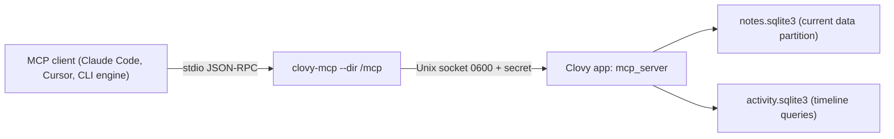

# Clovy MCP server

Local MCP clients (Claude Code, Cursor, and the CLI chat engines) read the
current data partition's notes, dictations, and memories, and the
installation's activity, through a stdio MCP server, `clovy-mcp`. It is off by
default, answers only while Clovy is open with the server turned on in
Settings, Agent, and everything is read-only. Requirements: the
`clovy-mcp-server` spec of the OpenSpec change `add-activity-intelligence`;
decision records: [ADR-0058](adr/0058-clovy-mcp-server-relays-to-the-running-app.md)
(the relay) and
[ADR-0059](adr/0059-activity-is-per-installation-not-per-data-partition.md)
(activity has no partition). Terms are in
[CONTEXT.md](../CONTEXT.md#activity-capture).

## Where the code lives

| Path | What |
| --- | --- |
| `src-tauri/src/mcp_server/mod.rs` | Switch, listener lifecycle, Tauri commands, configuration snippets, per-message data access |
| `src-tauri/src/mcp_server/channel.rs` | Unix socket + installation secret, handshake, listener, client connect |
| `src-tauri/src/mcp_server/stdio.rs` | The `clovy-mcp` relay (and its answers while the app is unreachable) |
| `src-tauri/src/mcp_server/protocol.rs` | MCP JSON-RPC: lifecycle, `tools/*`, `resources/*`, `clovy://context`, `clovy://guide` |
| `src-tauri/src/mcp_server/tools.rs` | The tools and their limits |
| `src-tauri/src/bin/clovy_mcp.rs` | Binary entry point |
| `src-tauri/bundle-clovy-mcp.sh` | macOS `beforeBundleCommand` step: copies and signs the binary into `.tauri-helper/` |
| `src/components/settings/McpServerSection.tsx`, `src/lib/mcp-server.ts` | Settings, Agent section and its bindings |

Tests: `cargo test mcp_server` (protocol against test databases, the relay
through a real socket, refusal without the secret, connection and request
limits, JSON-RPC validation, oversized lines, calendar context across
daylight-saving changes, serialized settings updates, coding-agent blocks, and
`src-tauri/tests/mcp_server_stdio.rs`: the built `clovy-mcp` binary spawned
over stdio against the app side served in the test process, including the
debug build's refusal of production data), `src/test/mcp-server-section.test.tsx`,
and `src/test/mcp-server-dev-runner.test.ts` (the development runner builds the
relay).

## Shape

The binary never opens a database: the activity key lives only in the
Keychain for the app, and the capture thread owns the activity store. It
relays each line to the app, which answers with the same queries, exclusions,
and retention as the agent tools and the "Today" view.

## Local channel

- Directory `<app data dir>/mcp/` (mode 0700): `clovy.sock` (Unix socket, mode
  0600) and `secret` (64 hex characters, mode 0600, created the first time the
  server starts and kept across restarts: the installation secret).
- The listener runs only while the switch is on; turning it off closes every
  connection and removes the socket. A socket left by a crash is replaced on the
  next start.
- Handshake: the client's first line is `{"clovyMcp": 1, "secret": "<hex>"}`.
  The app checks the peer's user id (same user only) and compares the secret in
  constant time, then answers `{"clovyMcp": 1, "ok": true}`, or
  `{"clovyMcp": 1, "ok": false, "error": "unauthorized"}` (or `"busy"`, see
  limits) and closes.
- After `ok`: newline-delimited MCP JSON-RPC messages in both directions, at
  most 4 MiB per line; requests run concurrently and answers may arrive out of
  order (matched by `id`).
- Limits (any process of the same user can reach the socket; `channel.rs`):
  - at most 4 connections waiting for their handshake (5 s each); more are
    closed as soon as they are accepted, before any read;
  - at most 8 authenticated connections; the next gets `"busy"`;
  - at most 4 requests of one connection being answered at once; the app
    stops reading that connection until one finishes, so a fast client waits
    in its own socket buffer instead of growing the app's memory;
  - persistent `accept` errors (out of descriptors) back off 100 ms.
- Unix socket paths are limited to 104 bytes on macOS; a data dir deeper than
  that makes the server fail to start with the error shown in Settings.

## The relay while Clovy is unreachable

`clovy-mcp` answers by itself so the client sees why: `initialize` and `ping`
succeed (the instructions carry the reason), `tools/call` returns an
`isError` result with the reason, other requests fail with JSON-RPC error
`-32000`. Reasons: never turned on (no secret yet), off or Clovy not open (no
socket or nobody listening), secret refused, every connection slot busy, or
Clovy closed the connection mid-request (pending requests get that error).
Each message retries the connection, so turning the server on (or opening
Clovy) needs no client restart.

The relay also validates its input before anything reaches the app: a stdin
line longer than 4 MiB is skipped to its newline without being kept and
answered with `-32600` (id `null`); a line that is not JSON gets `-32700`; an
object that is not a valid JSON-RPC 2.0 request or notification (no or
non-string `method`, `jsonrpc` other than `"2.0"`, an id that is not a string
or number, a batch array) gets `-32600` with its id when usable. The app
applies the same validation to messages it receives. Notifications and
responses sent by the client get no answer.

**Debug builds and production data.** A debug `clovy-mcp` refuses a `--dir`
under the installed app's data directory
(`~/Library/Application Support/co.opensoftware.june`), answering every
message with that reason, unless `OS_CLOVY_USE_PROD_DATA_DIR` is set (the same
opt-in the debug app honors). Development snippets point at the `-dev` data
directory.

## Tools and resources

Names are fixed in the `clovy-mcp-server` spec. Every tool is read-only
(`readOnlyHint`). Notes, dictations, and memories are limited to the current
data partition; activity tools read the installation's activity, whichever
partition is open ([ADR-0059](adr/0059-activity-is-per-installation-not-per-data-partition.md)).
Activity tools are listed only while activity capture is on and refuse with
`activity_capture_off` otherwise; they apply the current app and domain
exclusions and the retention period like the agent tools
([activity-timeline.md](activity-timeline.md)). Tool failures come back as
`isError` results with `message (code)`.

| Tool | Arguments | Result and limits |
| --- | --- | --- |
| `search_notes` | `query`, `limit` (1-20, default 10) | Notes whose title, text, or a transcript contains `query`: id, title, snippet (about 160 characters around the match), `matchedIn`, dates |
| `get_note` | `id`, `transcriptOffset` | Title, text (first 20,000 characters, `contentTruncated`), latest transcript in pages of 40,000 characters (`nextTranscriptOffset`) |
| `list_dictations` | `query`, `limit` (1-50, default 20), `offset` | Dictations of the last 7 days, newest first, text up to 4,000 characters each, `hasMore`/`nextOffset` |
| `list_memories` | `projectId`, `includeGlobal`, `limit` (1-20, default 8), `offset` | Same as the agent tool; refuses while memory is off (globally or for the project) |
| `get_activity_timeline` | `from`, `to` | The agent tool: sessions, gaps, stats (300 sessions/gaps at most, `truncated`) |
| `search_activity` | `query`, `from`, `to`, `limit` (1-50) | The agent tool: moments, app, window, URL, snippet |
| `get_activity_stats` | `from`, `to` | Focused, idle, away minutes, top 5 apps, minutes per category |
| `get_active_session` | none | The session in progress and the ongoing gap (looking back 12 hours); `lastSession` when nothing is active |
| `list_app_usage` | `from`, `to`, `limit` (1-100, default 20) | Minutes and session count per app, most used first, `totalApps`, `truncated` |
| `get_session_detail` | `id` | Session, its windows and URLs (windows on excluded domains dropped, and the text excerpt with them), text excerpt; sessions excluded or past retention are "not found" |
| `list_coding_agent_sessions` | `from`, `to`, `limit` (1-50, default 20) | Coding-agent blocks overlapping the period ([coding-agent-sessions.md](coding-agent-sessions.md)), newest first: id, agent, source, session id, project, title, start and end, `activeMinutes`, prompts, replies, state, summary (else `firstPrompt`); only sources turned on in Settings, Activity and blocks within the retention period; never the transcript or the working directory; `totalBlocks`, `truncated` |
| `get_day_summary` | `date` (optional local `YYYY-MM-DD`, default today) | Day summary (headline, narrative, insights, standup: done, inProgress, blockers, hoursCovered, locale, provider, trigger, generatedAt), workstreams, and hour reports; `summary: null` with `state: "not_generated"` when none exists yet; respects retention |

Activity times are RFC 3339 with offset; omitted bounds mean today so far. `get_day_summary` takes a local date `YYYY-MM-DD` (default today).

Resources: `clovy://context` (JSON: `now`, `date`, `time`, `weekday`,
`timeZone` (IANA name from `TZ` or `/etc/localtime`), `utcOffset`,
`yesterday`, `startOfToday`) and `clovy://guide` (Markdown: which tool answers
which question, dates, limits, privacy). `yesterday` is the previous local
date and `startOfToday` the first local moment of today with the offset in
force then (midnight, or the first minute after a daylight-saving jump that
skips it), not "now minus 24 hours" or now's offset.

## Configuration for clients

`mcp_server_status` returns the snippets the Settings section copies; they all
run the bundled binary with the channel directory:

- Command: `<Clovy.app>/Contents/Resources/native/bin/clovy-mcp` (development
  builds: next to the app executable in `src-tauri/target/<profile>/`;
  `scripts/cargo-clovy-runner.sh` builds it with the app on every
  `pnpm tauri:dev`).
- Args: `["--dir", "<app data dir>/mcp"]`. No environment variables.
- Claude Code: `claude mcp add --scope user clovy -- <command> --dir '<dir>'`,
  or `{"mcpServers": {"clovy": {"type": "stdio", "command": ..., "args": [...]}}}`
  in `.mcp.json` / `--mcp-config`.
- Cursor: the same object without `type` in `~/.cursor/mcp.json`.

Moving Clovy.app changes the command path; copy the configuration again.

### For child processes (CLI chat engines)

`crate::mcp_server::child_process_launch(&app)` returns the `McpLaunch`
(`command`, `args`; no env) or `mcp_server_binary_missing`;
`crate::mcp_server::claude_code_config(&launch)` builds the `mcpServers` object
to write to a temporary file for `claude --mcp-config <file>` or translate
for another CLI. The server must be on for its tools to answer; otherwise the
child gets the relay's "off" errors.

## Storage of the switch

`mcpServer` in `activity-settings.json` (default `false`). Only
`mcp_server_set_enabled` changes it; `activity_save_settings` keeps the stored
value so a stale Activity tab cannot flip it. Both go through
`ActivityShared::update_settings`, which holds one lock across reading the
latest settings, writing the file, and publishing them, so an Activity save
and an MCP toggle at the same moment never undo each other. The listener
starts at app setup when the switch is on. macOS only (`supported: false`
elsewhere hides the section).
